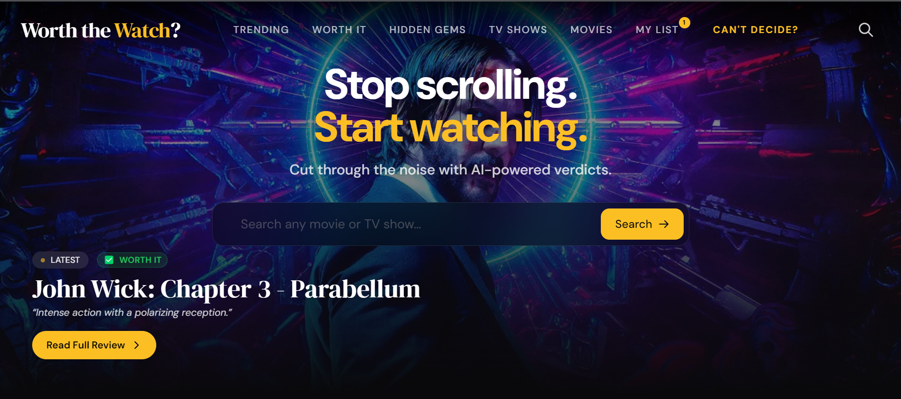
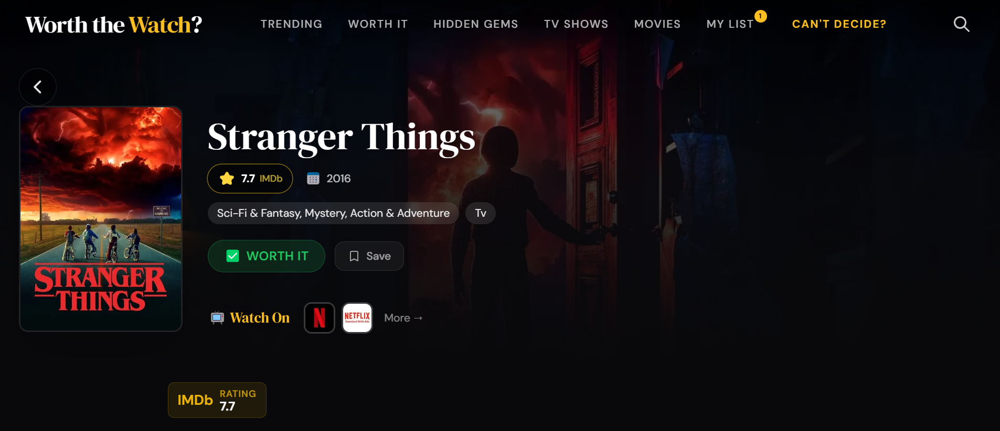
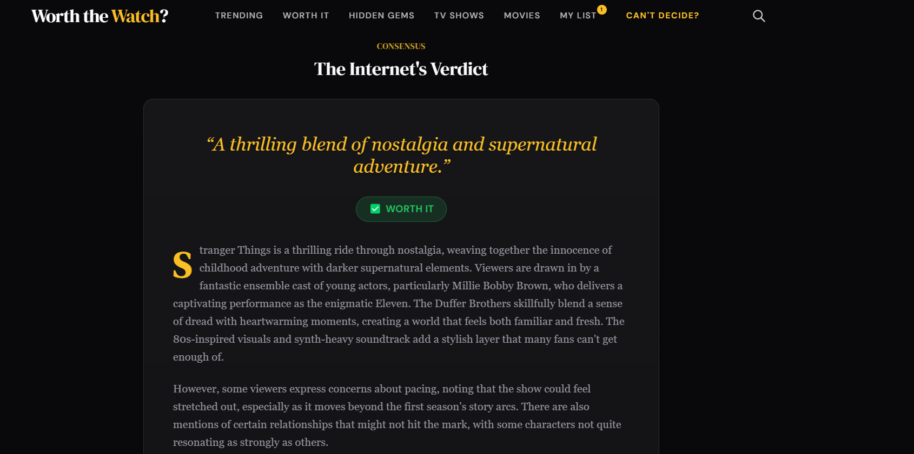
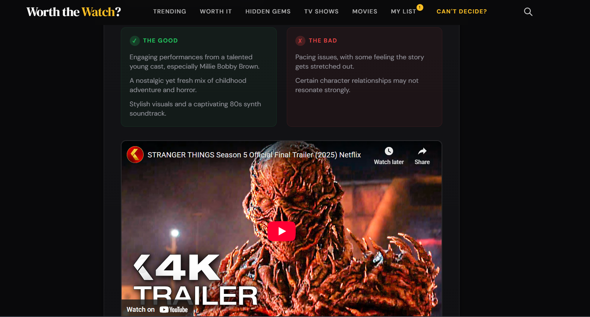
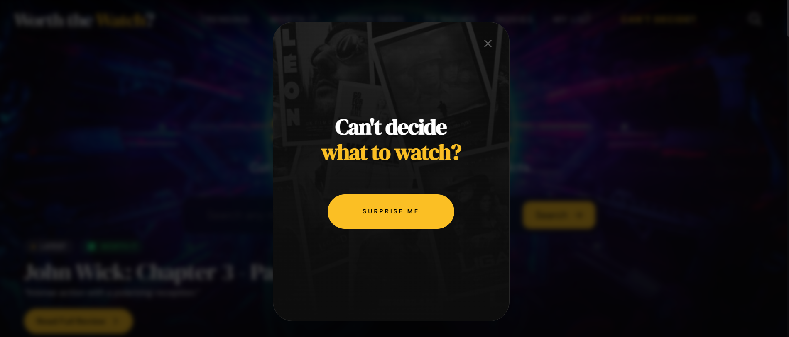
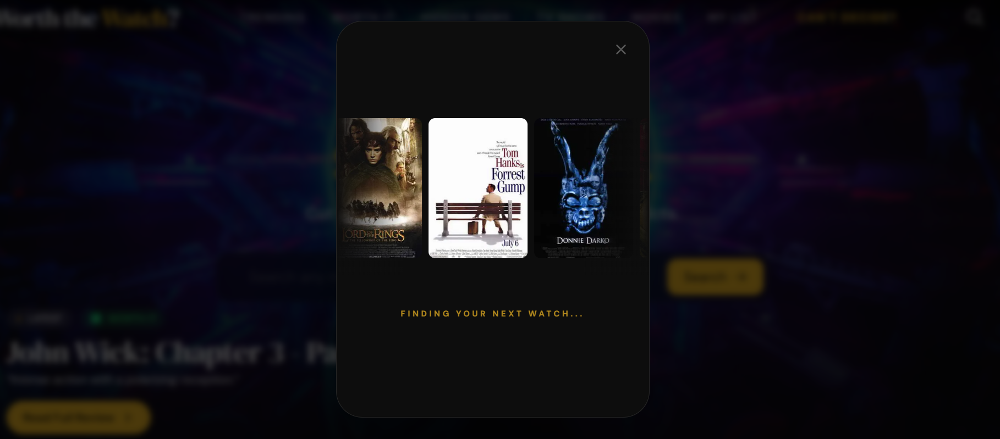
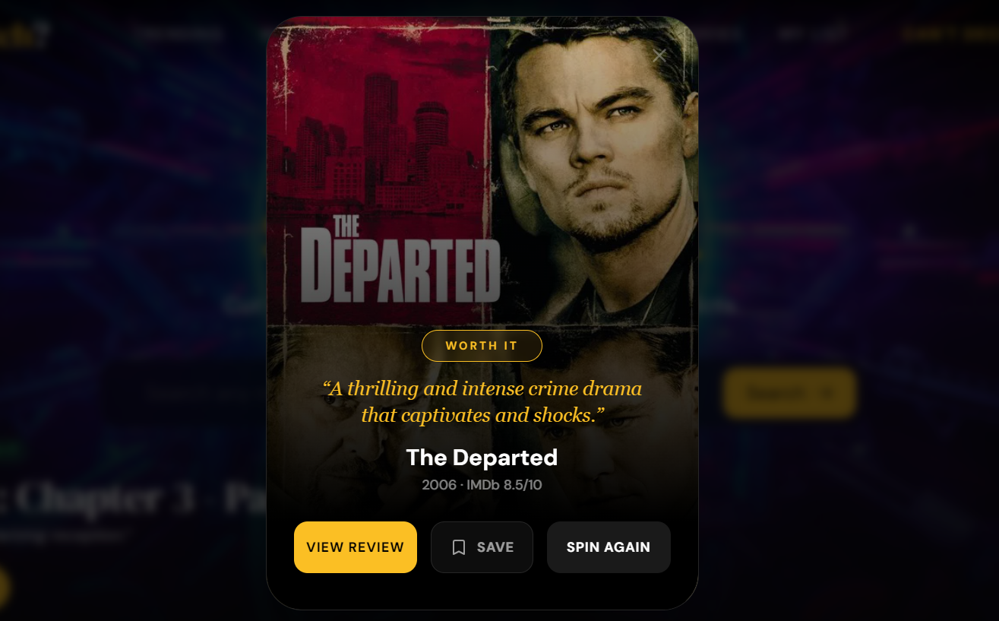
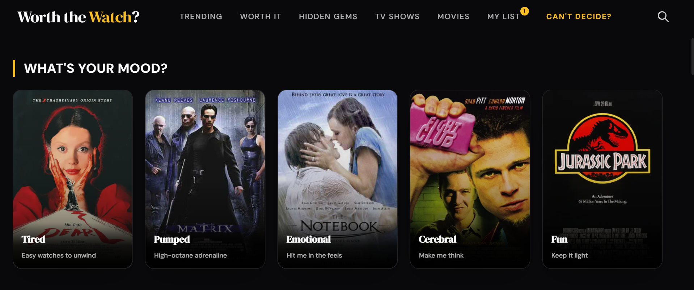
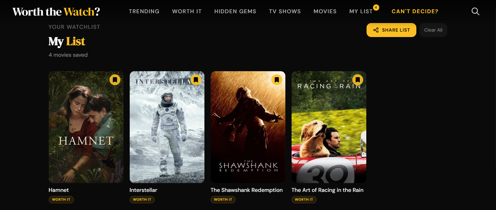

# Worth the Watch?
**Should I stream this? The internet decides.**

Built by **Roshan Shetty** — [Portfolio](https://www.roshanshetty.dev/) | [LinkedIn](https://www.linkedin.com/in/roshanshetty271/)  
Live App: [worth-the-watch.com](https://worth-the-watch.com/)

---

## What It Does
"Worth the Watch?" solves the modern decision fatigue of endless scrolling by providing a single, honest verdict on whether a movie or TV show is actually worth your time. By aggregating professional critic reviews from sources like The Guardian and NYT alongside raw audience sentiment from Reddit, the app uses AI to cut through the marketing noise and deliver a definitive answer. Research shows the average person spends 110 hours a year just deciding what to watch—this app aims to give that time back.

## Key Features
- **AI-Powered Review Synthesis** — Scrapes critics and Reddit in real-time, synthesizing hundreds of opinions into honest verdicts: **WORTH IT**, **NOT WORTH IT**, or **MIXED BAG**.
- **Consistent, Score-Backed Verdicts** — A deterministic consensus over IMDb, Rotten Tomatoes, Metacritic, and Letterboxd gets the final say, so the same title can't flip verdicts between visits.
- **Always-Current Stats** — Ratings, box office, and awards refresh automatically on a background job (no AI cost), so the numbers never go stale long after a review was written.
- **Cinema Roulette** — A high-stakes random movie picker with a slot-machine animation that only serves "WORTH IT" titles, ensuring you never land on a dud.
- **Mood-Based Discovery** — Browse curated collections based on how you feel (Tired, Pumped, Emotional, Cerebral, Fun) using a multi-layered genre and tag filtering system.
- **For You** — Personalized recommendations that learn from your watchlist, weighting saved titles to surface unseen WORTH IT picks in the genres you actually reach for.
- **Bookmark & Share Lists** — Save your watchlist and generate shareable custom URLs without needing an account.
- **Worth-It Digest** — An opt-in monthly email rounding up fresh WORTH IT picks and what's breaking out right now, with one-click unsubscribe.
- **Streaming Availability** — Integrated JustWatch data showing exactly where to stream, rent, or buy across all major platforms.

## Tech Stack
- **Frontend**: Next.js 16, TypeScript, Tailwind CSS, Framer Motion
- **Backend**: FastAPI, Python 3.11, SQLAlchemy (Async), Pydantic
- **Database**: Neon PostgreSQL (Serverless)
- **AI/LLM**: OpenAI GPT-4o-mini / DeepSeek-V3 (with automatic failover)
- **Auth**: NextAuth.js v5 (Google OAuth, Neon adapter)
- **APIs**: TMDB, Guardian, NYT, Serper, OMDB, KinoCheck, Jina Reader
- **Testing**: Playwright (E2E, accessibility via axe-core)
- **Hosting**: Vercel (Frontend), Koyeb (Backend), Neon (Database)
- *All infrastructure is running on optimized free-tier configurations.*

## Architecture
The core of the application is a high-speed asynchronous pipeline that follows a 5-step process:
1. **Search**: Orchestrates simultaneous queries to Serper, The Guardian, and NYT.
2. **Scrape**: Uses a "race-to-5" strategy to fetch the fastest 5 quality articles using `selectolax` for sub-millisecond HTML parsing.
3. **Filter**: Implements a custom "grep" logic to isolate opinion-dense paragraphs and strip out noise/ads.
4. **Synthesize**: Passes filtered context to the LLM with a multi-tier confidence system (HIGH/MEDIUM/LOW); the LLM writes the review and *proposes* a verdict.
5. **Decide**: A deterministic, vote-weighted score consensus (IMDb, Rotten Tomatoes, Metacritic, Letterboxd) makes the final call — overriding the LLM when the ratings are clear and deferring to it only in genuinely ambiguous cases. This is what keeps verdicts stable and reproducible.

## Screenshots

*Modern, immersive hero section with quick search and trending updates.*

<table width="100%">
  <tr>
    <td width="33.33%" align="center"> <b>Sentiment Analysis</b></td>
    <td width="33.33%" align="center"> <b>Pros & Cons</b></td>
    <td width="33.33%" align="center"> <b>Streaming Availability</b></td>
  </tr>
</table>

<i>AI-synthesized reviews with sentiment breakdown, praise/criticism points, and real-time streaming data.</i>

<table width="100%">
  <tr>
    <td width="33.33%" align="center"> <b>1. Start</b></td>
    <td width="33.33%" align="center"> <b>2. Spin</b></td>
    <td width="33.33%" align="center"> <b>3. Reveal</b></td>
  </tr>
</table>

<i>Interactive "Cinema Roulette" with a high-stakes slot-machine animation and guaranteed "Worth It" results.</i>

*Horizontal category browsing for personalized movie matching.*

*Shareable watchlist management with zero-auth persistence.*

---

© 2026 Roshan Shetty. All rights reserved.
This codebase is **Source-Available** for educational review only. It is **NOT** Open Source.
See [LICENSE](LICENSE) for strict usage prohibitions.

*Built as a portfolio project demonstrating full-stack development, AI integration, and product thinking.*